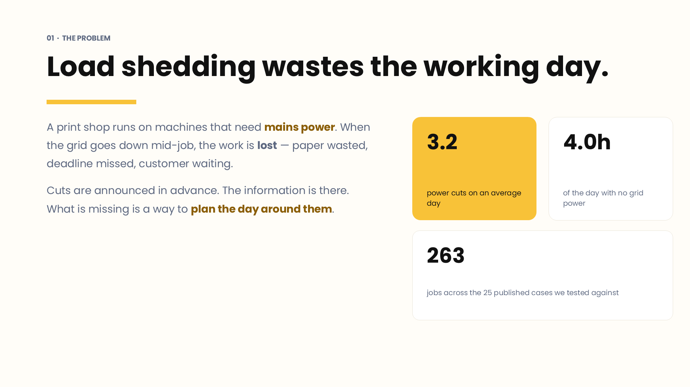
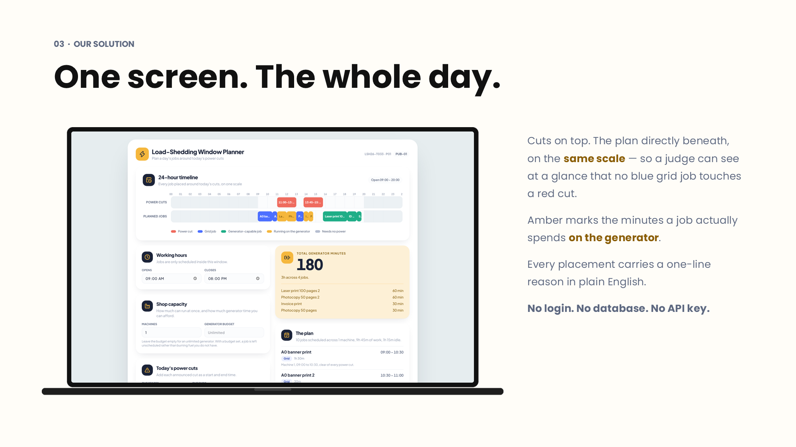
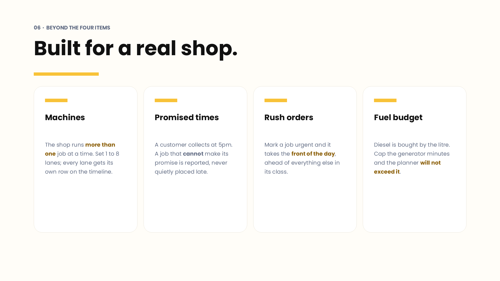
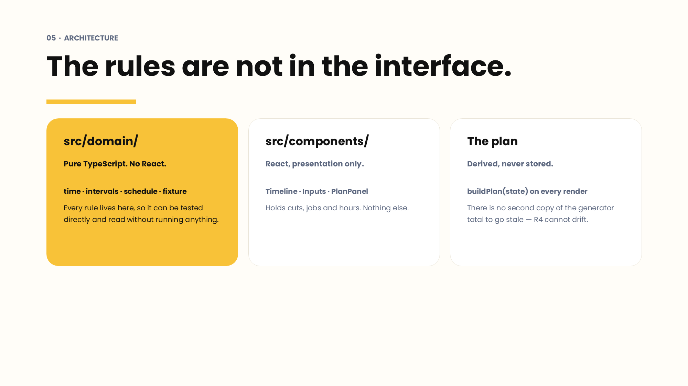
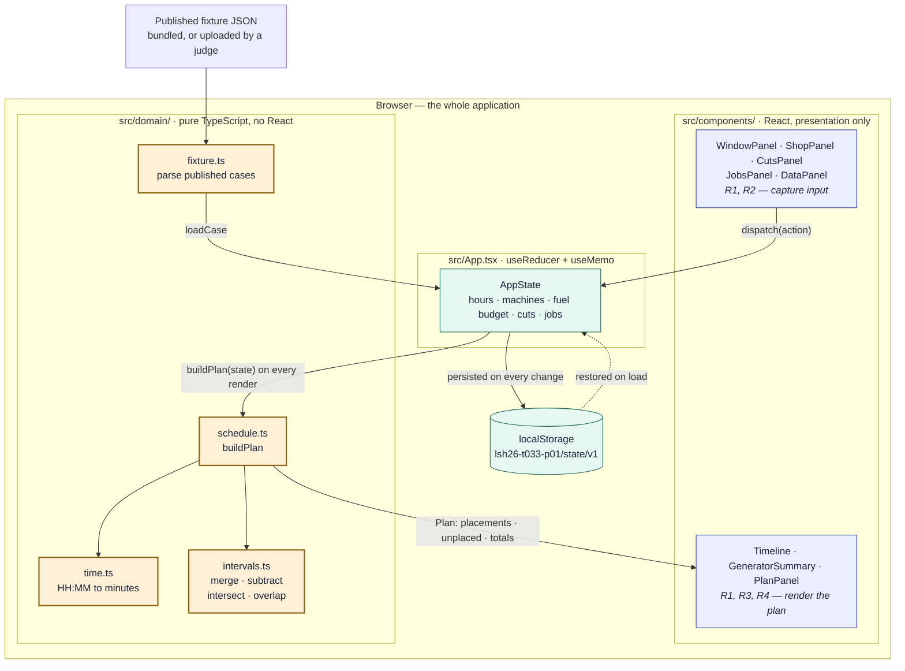
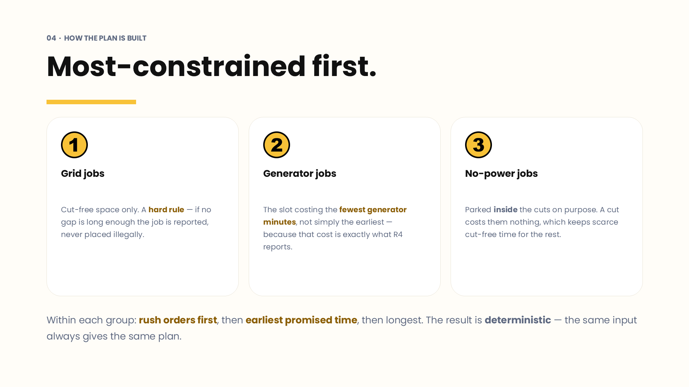
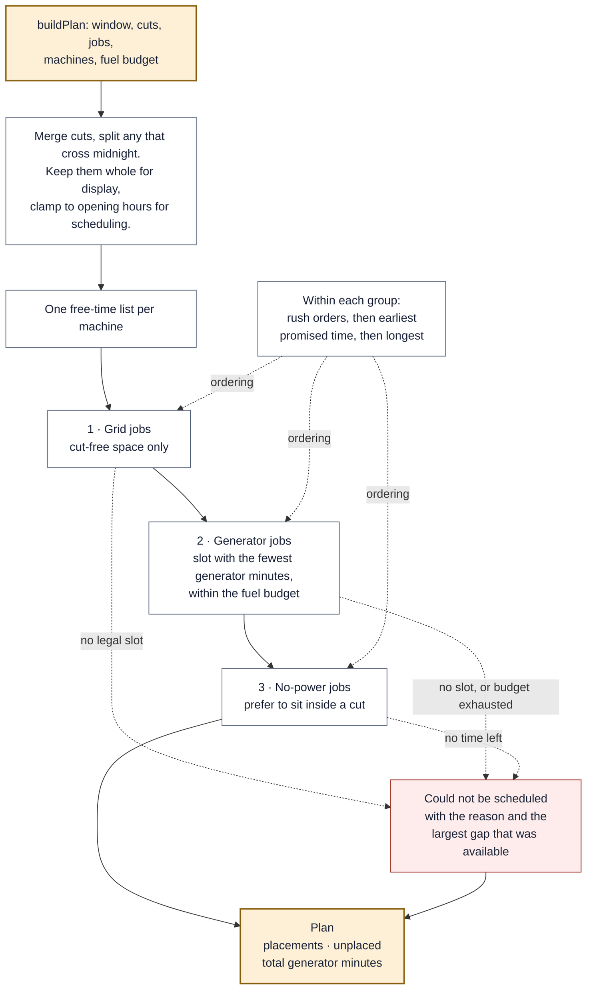
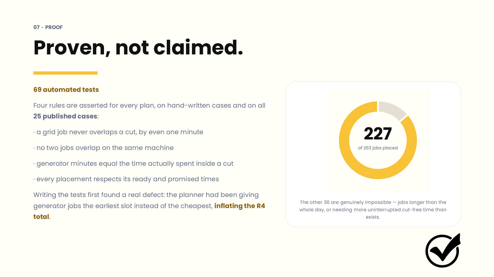
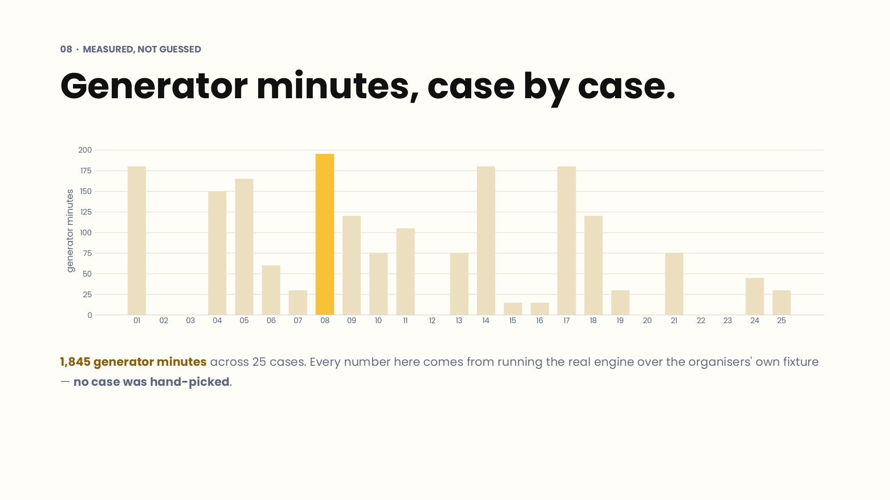
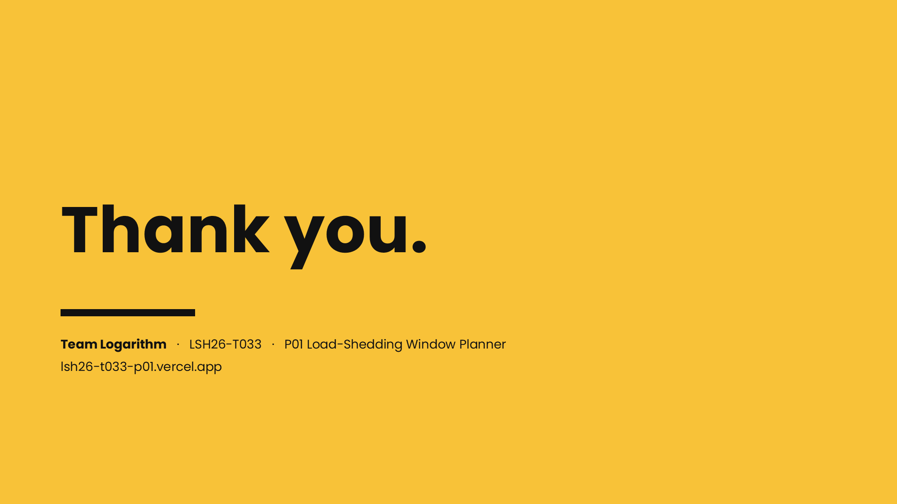

# Load-Shedding Window Planner

Solution for **LofiStack Hackathon 2026 — P01**

- **Team:** `Logarithm`
- **Team ID:** `LSH26-T033`
- **Problem:** `P01 — Load-Shedding Window Planner` (Tier 01)
- **Live application:** <https://lsh26-t033-p01.vercel.app>
- **Presentation:** [**View the slides**](https://docs.google.com/presentation/d/12Vf_FUQm3nEeculQZRHJ6AxHEu0to_xM/edit?usp=drive_link&ouid=101782489806446060113&rtpof=true&sd=true) — source file [`Slide/LSH26-T033-P01.pptx`](Slide/LSH26-T033-P01.pptx)
- **Demo video:** not supplied; the method and per-member contributions are recorded below and in the manifest

> Judges evaluate only the exact commit SHA entered in the Final Submission Form.

---

## The problem

Load shedding takes hours out of the working day. A print shop runs on machines that need mains
power, so when the grid goes down mid-job the work is lost — paper wasted, deadline missed, customer
waiting. The cuts are announced in advance; what is missing is a way to plan the day around them.



---

## Solution summary

A print shop plans its day around announced load shedding. You enter the shop's opening hours and
today's power cuts, then add the jobs waiting to be done. The planner lays every job out on a
24-hour timeline so that **no job needing grid power ever lands inside a cut**, and reports how many
**generator minutes** the resulting plan costs. It runs entirely in the browser — no account, no
server, no API key.



---

## Requirements

All four required items are **complete**, and each is covered by automated tests.

| # | Requirement | Status | Where to verify in the app | Source |
|---|---|---|---|---|
| **R1** | Enter today's power cuts as a start and an end time, shown on a 24-hour timeline | Complete | **Today's power cuts** panel → red bars appear on the **Power cuts** row | [`Inputs.tsx`](src/components/Inputs.tsx) `CutsPanel`, [`Timeline.tsx`](src/components/Timeline.tsx) |
| **R2** | Add jobs with a name, a duration in minutes, and a power need (grid / generator / none) | Complete | **Jobs** panel — name, minutes, and the three power needs in the dropdown | [`Inputs.tsx`](src/components/Inputs.tsx) `JobsPanel` |
| **R3** | Place jobs automatically so grid jobs never fall inside a cut; show the plan next to the cut bars | Complete | **Planned jobs** row sits directly beneath **Power cuts** on the same scale; written plan in **The plan** | [`schedule.ts`](src/domain/schedule.ts) `buildPlan` |
| **R4** | Show total generator minutes, updating as soon as a job is added or removed | Complete | **Total generator minutes** card — recomputed on every state change | [`App.tsx`](src/App.tsx), [`Timeline.tsx`](src/components/Timeline.tsx) `GeneratorSummary` |

### Beyond the four required items

Four constraints a real Dhaka print shop actually faces. Each is optional, so the behaviour above is
unchanged unless you use them.

| Feature | What it does | Why it matters |
|---|---|---|
| **Machines (1–8)** | Runs jobs in parallel across lanes; each machine gets its own row on the timeline | A shop is not one worktop. One machine is the default and reproduces single-lane behaviour exactly |
| **Promised by** | A job must finish by its promised time, or it is reported as unschedulable | A customer is collecting at 5pm. Placing the job late is worse than saying it cannot be done |
| **Ready from** | A job cannot start before its material or artwork arrives | Work is not always ready at opening time |
| **Rush order** | Marks a job urgent; it takes the front of the day within its power class | Every shop has a job that jumps the queue |
| **Generator fuel budget** | Caps the generator minutes the plan may spend; a job that would break the cap is reported | Diesel is bought by the litre. The budget is a real constraint, not a preference |



---

## How to test the application

1. Open <https://lsh26-t033-p01.vercel.app>.
2. Press **Load published sample data**. All 25 published cases load and `PUB-01` is applied. Use
   the **Case** dropdown to switch between them.
3. **Check R1 and R3 visually.** Red bars are power cuts. Directly beneath, on the same scale, blue
   bars are grid jobs — none of them overlaps a red bar. Amber marks the stretch of a job actually
   running on the generator.
4. **Check R4.** Read **Total generator minutes** at the top right, then remove a job in the **Jobs**
   panel; the number changes immediately.
5. **Check R3 by hand.** Press **Reset**, add a cut of `09:00`–`11:00`, then add a 60-minute job
   needing grid power. It is placed at **11:00**, not inside the cut.
6. **Check a promised time.** Add a 240-minute job needing no power, then a 60-minute grid job
   promised by `11:00`. The promised job is scheduled first, at `09:00`–`10:00`.
7. **Check the fuel budget.** Add a cut covering the whole day, set **Generator budget** to `30`,
   and add a 60-minute generator job. It is reported under **Could not be scheduled** with the
   reason, and the generator total stays at `0`.

### Sample data, judges' own cases, and reset

The published fixture is committed twice on purpose: at
[`sample-data/P01_load_shedding_public.json`](sample-data/P01_load_shedding_public.json) as the
record of what was supplied, and in `public/` so the deployed app can load it in one click.

**Your own cases:** press **Upload JSON** and pick any file in the published `P01` shape. Unknown
keys are ignored, and a case that cannot be read is skipped with a warning rather than failing the
whole file — a file with 25 good cases and one broken one still loads.

**Reset:** the **Reset** button in the **Sample data** panel clears all cuts and jobs and restores
`09:00`–`21:00` working hours, 1 machine and an unlimited generator. State lives in `localStorage`
under `lsh26-t033-p01/state/v1`; clearing site data has the same effect.

---

## Run locally

### Requirements

- Node.js 20.19+ or 22.12+ (built and tested on Node 24)
- **No database, no API key, no environment variables, no paid account**

### Setup

```bash
git clone https://github.com/AuvroIslam/lsh26-t033-p01.git
cd lsh26-t033-p01
npm install
npm run dev        # http://localhost:5173
```

| Command | What it does |
|---|---|
| `npm run dev` | Development server with hot reload |
| `npm test` | The full suite — 69 tests |
| `npm run build` | Type-checks with `tsc -b`, then produces `dist/` |
| `npm run preview` | Serves the production build locally |

---

## System architecture

Everything runs in the browser. There is no server, no database and no network call after the page
loads — the only fetch is the bundled sample-data file, and even that is optional.

The important property is the direction of the arrows: **the scheduling rules never depend on
React.** `src/domain/` is plain TypeScript that can be run, tested and read on its own.





**Why it is built this way.** The plan is *derived*, never stored: `buildPlan(state)` runs on every
render inside a `useMemo`. There is no second copy of the generator total to fall out of step with
the jobs on screen, which is exactly what R4 demands. It also makes the whole scheduler a pure
function — the same input always produces the same plan, which is what makes it testable.

### How a plan is built





**Most-constrained first.** Grid jobs have the least freedom, so they choose from cut-free time
before anything else touches it. Generator jobs then take the slot that overlaps the cuts by the
*least* — not simply the earliest — because that overlap is exactly the number R4 reports. Jobs
needing no power are parked **inside** the cuts on purpose: a cut costs them nothing, and it keeps
scarce cut-free time available for jobs that need it.

Finding the cheapest generator slot does not need a minute-by-minute scan. Overlap with the cuts, as
a function of start time, only changes direction where the job's leading or trailing edge crosses a
cut boundary — so checking each gap's start, each gap's latest start, and every cut edge is enough
to find a true minimum.

---

## Colour palette

### Application

Defined once as CSS custom properties in [`src/index.css`](src/index.css) and consumed as Tailwind v4
theme tokens, so no colour is hard-coded in a component. Colour carries meaning: every hue on the
timeline maps to one power state.

| Token | Hex | Used for |
|---|---|---|
| `ground` | `#E6EDEF` | Page behind the app shell |
| `shell` | `#FFFFFF` | The floating card everything sits on |
| `panel` | `#FBFCFD` | Input fields, timeline tracks, quiet chips |
| `hairline` | `#ECEFF4` | Borders, dividers, hour gridlines |
| `ink` | `#1B2338` | Primary text, icon tiles |
| `ink-soft` | `#5D6880` | Secondary text, labels |
| `ink-faint` | `#98A1B4` | Hints, empty states |
| `accent` | `#F5B73D` | Generator identity — buttons, fuel card, on-generator bars |
| `accent-soft` / `accent-deep` | `#FDF0D6` / `#8A6111` | Generator card ground / its text |
| `cut` | `#EF6B5E` | **Power cut** bars and failure states |
| `cut-soft` / `cut-deep` | `#FDECEB` / `#96271C` | Unschedulable panel / its text |
| `grid` | `#4C6FFF` | **Grid job** bars — the jobs that must avoid cuts |
| `grid-soft` / `grid-deep` | `#EAEEFE` / `#2740A8` | Grid badge / its text |
| `gen` | `#1FAE87` | **Generator-capable job** bars |
| `gen-soft` / `gen-deep` | `#E6F6F1` / `#10634C` | Generator badge / its text |
| `idle` | `#B6BED0` | **Needs no power** bars |

Typeface: **Plus Jakarta Sans**, with tabular figures everywhere a time or a duration appears so
columns of numbers line up.

### Presentation

The deck uses a deliberately narrower palette — one accent, one ink, one ground — so the slides read
at projector distance.

| Role | Hex | Used for |
|---|---|---|
| Cream | `#FFFDF8` | Slide ground |
| Amber | `#F8C238` | Title and closing slides, accent rules, chart highlight |
| Ink | `#111111` | Headings and body |
| Ink soft | `#5D6880` | Supporting text, chart labels |
| Card | `#FFFFFF` | Content cards |
| Line | `#E8E3D6` | Card borders |
| Highlight | `#8A5D05` | Emphasised words — a deeper amber, because `#F8C238` on cream is only about 1.9:1 and unreadable projected |

Typeface: **Poppins**. If it is not installed, PowerPoint substitutes another face and the deck will
not look right; the font files are in [`Slide/assets/`](Slide/assets/).

---

## Testing



`npm test` runs **69 tests** — 58 over the domain and 11 driving the real interface in a DOM.

| Suite | Covers |
|---|---|
| [`src/domain/schedule.test.ts`](src/domain/schedule.test.ts) | R1–R4 rules, promised and ready times, multiple machines, the fuel budget, edge cases, and **all 25 published fixture cases** |
| [`src/App.test.tsx`](src/App.test.tsx) | The four requirements and every extra feature, driven through the rendered interface |

Rather than asserting one expected output per case, the suite asserts the **rules a plan must always
obey**, then applies that same check to hand-written cases and to every published case:

- a **grid job never overlaps a cut**, by even one minute
- **no two jobs overlap on the same machine** (different machines may run in parallel)
- every placement is exactly as long as its job asked for, and inside the working window
- **generator minutes equal the time actually spent inside a cut** — and are never charged to a job
  that needs no power
- every placement respects its own **ready** and **promised** times
- the plan **never exceeds the fuel budget**
- the headline total equals the sum of its parts

Writing the tests first found a real defect: the planner had been giving generator jobs the
*earliest* slot rather than the *cheapest*, inflating the R4 total. The fix is the cheapest-slot
search described above.

### Measured on the published data



Running the engine over the organisers' own fixture — no case hand-picked:

| Metric | Value |
|---|---|
| Cases | 25 |
| Jobs | 263 |
| Placed | **227** (86%) |
| Genuinely impossible | 36 |
| Total generator minutes | 1,845 |

The 36 are not failures. `PUB-12` asks for 2,145 minutes of work in a 720-minute day and contains
two jobs longer than the whole window; `PUB-14`'s unplaced grid jobs need 195 and 180 uninterrupted
cut-free minutes when the longest cut-free gap in the day is 150. Each is reported with its reason
and the largest gap that was available. See [Known limitations](#known-limitations) for the one case
where a better plan does exist.

Regenerate these numbers with `npx vite-node Slide/stats.ts`.

---

## Problem-solving approach

**Understanding the problem.** The four items are one hard scheduling rule plus a number derived from
it. The rule is a constraint — a grid job must not touch a cut — and total generator minutes is the
*cost* of the plan. Everything else is presentation.

**The chosen solution.** All scheduling lives in `src/domain/` as plain functions with no React, so
the rules can be tested directly and read by a judge without running anything. The interface holds
only the working hours, the cuts and the jobs; the plan is derived on every render and never stored.

**The most important decision.** Generator minutes count only the time a generator-capable job
actually spends *inside a cut* — not its whole duration. A generator-capable job on mains costs
nothing; it draws on the generator only while the grid is down. Counting the full duration would
overstate fuel and make R4 meaningless as a cost.

**How it was tested.** Invariants first, then hand-written cases, then all 25 published cases, then
the same requirements again through the DOM. Two defects were found this way; both are described
above and under limitations.

---

## Technology used

- **Frontend:** React 19, TypeScript 5.9 (strict, with `noUncheckedIndexedAccess`)
- **Backend:** none — entirely client-side
- **Database:** none — state is held in the browser's `localStorage`
- **Build and test:** Vite 7, Vitest 3, Testing Library, jsdom
- **Styling:** Tailwind CSS v4 with CSS custom-property tokens
- **Icons:** Lucide
- **Deployment:** Vercel (static build, no server functions)

See [`LICENSES.md`](LICENSES.md) for all third-party material.

---

## Team contributions

> Each member confirms the line below is an accurate record of their own work.

| Registered member | GitHub username | Major contribution | Evidence |
| --- | --- | --- | --- |
| Oitijya Islam Auvro | `AuvroIslam` | Scheduling engine and domain model: the placement order, the cut-free constraint for grid jobs, and the cheapest-slot search that minimises generator minutes. | `src/domain/schedule.ts`, `src/domain/intervals.ts`, `src/domain/time.ts` |
| Md. Nafiz Ahmed | `Nafiz001` | Interface: the 24-hour timeline with aligned cut and machine rows, the cut and job entry forms with validation, and the live generator-minutes summary. | `src/components/Timeline.tsx`, `src/components/Inputs.tsx`, `src/components/PlanPanel.tsx`, `src/App.tsx` |
| Dewan Salman Rahman Zisan | `ripWr3ncH` | Fixture loading and verification: reading the published case format, the upload path for judges' own cases, and the test suites covering all 25 published cases. | `src/domain/fixture.ts`, `src/domain/schedule.test.ts`, `src/App.test.tsx`, `src/state.ts` |

Commit count alone does not represent contribution.

## AI usage

- **Claude (Anthropic), via Claude Code** — used during the event window for repository scaffolding,
  the scheduling engine, the interface, the test suites, this documentation and the deck generator.
  The team verified the output by reading the code, running all 69 tests including every published
  fixture case, and checking each required item by hand in the running application.

---

## Major design decisions

- **Each machine runs one job at a time, and jobs are never split.** A 90-minute job needs 90
  uninterrupted minutes. Splitting a print run around a power cut is not something a shop can
  generally do, and nothing in the problem permits it.
- **Generator minutes are the minutes actually spent inside a cut**, so the number means fuel rather
  than duration.
- **A generator job takes the cheapest slot, not the earliest.** That overlap is exactly what R4
  reports, so minimising it is the point.
- **Jobs needing no power are placed inside cuts deliberately**, keeping scarce cut-free time for
  jobs that need it.
- **An unplaceable job is reported, never hidden and never placed illegally**, with the reason and
  the largest gap that was available.
- **Promised times are hard constraints.** A job that cannot be finished in time is reported rather
  than quietly scheduled late — a late job is worse than one the shop knows it must decline.
- **The plan is derived, never stored**, so the R4 total cannot go stale.
- **Cuts are merged, shown in full, but applied only inside opening hours.** R1 asks for the cuts the
  user entered, so a cut outside opening hours still appears on the 24-hour timeline; only the part
  inside the working window can affect the plan.
- **A cut running past midnight is split at midnight when it is stored.** Entering `22:00`–`02:00`
  records `22:00`–`24:00` and `00:00`–`02:00`, so nothing downstream has to reason about an end time
  earlier than its start.
- **A compaction pass was written, measured and removed.** It moved jobs earlier when that cost no
  extra generator minutes; it changed none of the 25 published cases, so it was deleted rather than
  left in as untested complexity.

## Known limitations

- **The scheduler is greedy, and it optimises for generator minutes ahead of the number of jobs
  placed.** Across the 25 published cases it leaves 36 jobs unplaced; most are genuinely impossible
  (see [Measured on the published data](#measured-on-the-published-data)). `PUB-25` is the honest
  exception: it is only 45 minutes over capacity, yet 240 minutes of work is dropped while 195
  minutes sit idle in fragments of 60, 90 and 45. One more job would fit if a generator job were
  pushed into a cut to consolidate those fragments — but that would raise the very number R4 reports.
  The problem does not say which outcome is worth more, so the planner takes the reading it can
  defend: keep the generator total as low as possible, and report clearly what did not fit.
- **Jobs cannot be dragged or repositioned by hand.** The plan is computed; there is no manual
  override and no way to pin a job to a chosen time.
- **One day is modelled.** An overnight cut is split correctly, but work is never carried into
  tomorrow.
- **No print or export.** The plan is on screen only.
- **State is per browser.** `localStorage` is not shared between devices, and a private window starts
  empty.
- **Machines are interchangeable.** Every machine can run every job; there is no notion of a job that
  needs one specific press.

---

## Repository records

- [`EVENT.md`](EVENT.md) — event start code and pre-event-material declaration
- [`evaluation-manifest.json`](evaluation-manifest.json) — structured judging evidence
- [`LICENSES.md`](LICENSES.md) — frameworks, libraries, fonts, icons and assets

---

[**View the full presentation**](https://docs.google.com/presentation/d/12Vf_FUQm3nEeculQZRHJ6AxHEu0to_xM/edit?usp=drive_link&ouid=101782489806446060113&rtpof=true&sd=true)


